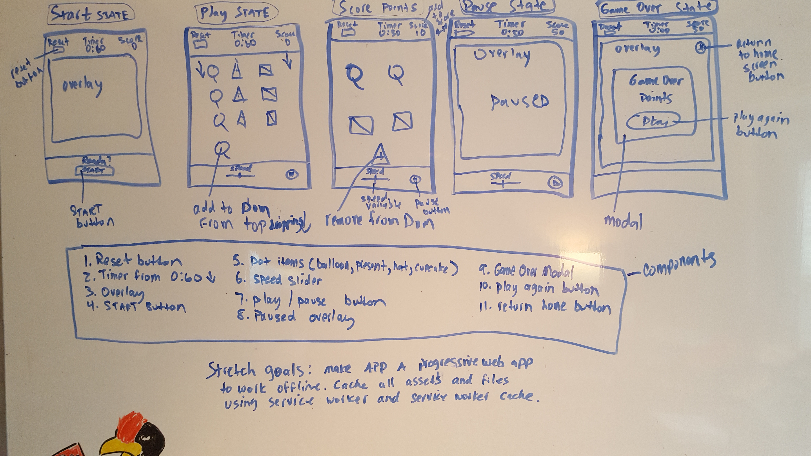
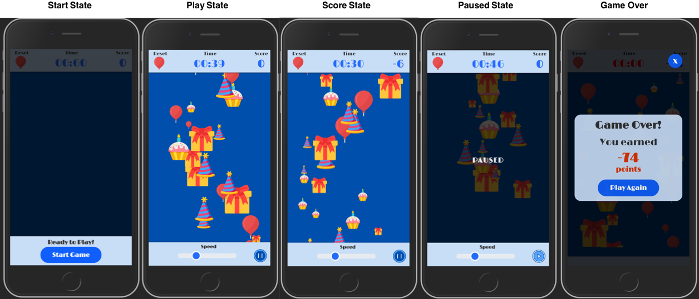

#  Birthday Theme Dot Game

## [Live Demo via Glitch](http://.glitch.me)

## [Github repository](https://github.com/)

## Overview

This a birthday themed dot game that was created using a mobile-first approach while utilizing traditional JavaScript and SCSS. It is also a PWA (Progressive Web Application) that caches all resources to the browser and can be played completely offline. 😆

This game is built with no frameworks or libraries -- just vanilla JS 🍦and SCSS! It simplifies DOM manipulations with state-based components using the data defined and managed on the `DotGame` class!

## Set Up

### Requirements

- [Node](https://nodejs.org/en/) (ver. 9+, built with 9.11.1)

### Launch App Locally

```
$ git clone <repo>
$ cd <root>
$ npm install
$ npm run start
```

Note: port number is randomly generated so check console

## Game Objectives

1. Click **Start Game**
2. Try to pop balloons, presents, cupcakes or party hats for points!
3. If items make it past the bottom of the screen you lose points, so act quickly!
4. Game ends when the timer runs out!

## UX Process

### User wants/needs

I started my process by thinking about what a user playing this game might want and came up with the following list of items:

A user:

- wants to play a mobile or desktop game that is simple and fun to play
- wants to make it accessible for visually impaired users by making buttons and items easy to locate and click
- wants the user interface to be easy to locate and use with easily identifiable buttons and clickable items.
- wants the user experience to be fun by creating a birthday theme with corresponding colors and images
- wants to be able to play game offline if user is in an area with a low quality mobile network.

### Whiteboard Mockup



### Design goals

- Create easily identifiable icons, buttons and objects that can be clicked effortlessly
- Create a fun and inviting user experience by utilizing bright colors with high background contrast and common birthday themed shapes.
- Allow smooth game play and state management with start, pause, reset and speed adjustment functionality.
- Allow points to be added to score for clicking items before disappearing from screen and points deducted for not clicking items before being removed from the DOM.
- Create a red countdown timer for final 10 seconds of game play to cue player that the end is imminent!
- Create zooming effect for clickable items (desktop only) to assist visually impaired users.

### State Flow created with Sketch



## Implementation
