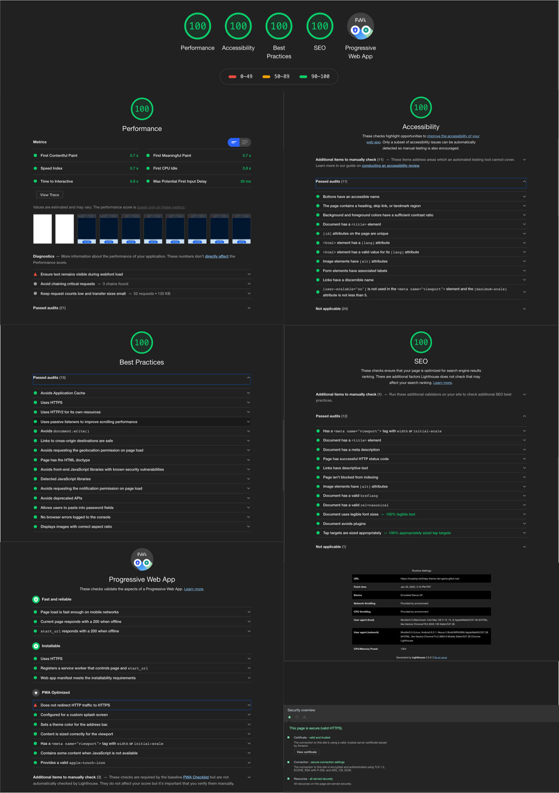
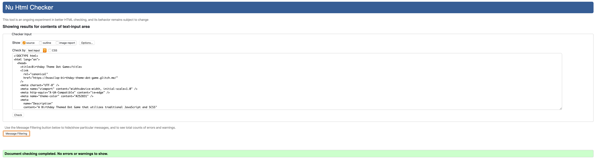
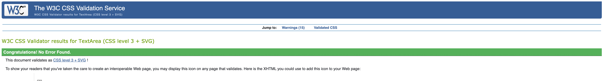

# 🎂 Birthday Theme Dot Game

## 🎮 [Live Demo via Glitch](https://bvasilop-birthday-theme-dot-game.glitch.me/)

## Overview

This a responsive and adaptive birthday themed dot game that was created using a mobile-first approach while utilizing traditional JavaScript and SCSS. It manipulates the DOM with state and class based components and easily allows for updating and scalability. This browser based game is also a PWA (Progressive Web Application) that caches all resources to the browser and can be played completely offline in the event of a disconnected mobile network.

## Set Up

### Requirements

- [Node](https://nodejs.org/en/) (ver. 10)

### Launch App Locally

```
$ git clone <repo>
$ cd <root>
$ npm install
$ npm run start
```

**Note:** Port number is randomly generated so please check console

## Game Objectives

1. Click **Start Game**
2. Try to pop balloons, presents, cupcakes and/or party hats for points!
3. If items make it past the bottom of the screen you lose points, so act quickly!
4. Game ends when the timer runs out!

## UX Process

### User Stories

_As a someone who enjoys playing games:_

- I want to play a mobile or desktop game that is simple and fun to play so that I may not be encumbered by complex game instructions.
- I want the game to be accessible to as many users as possible so that buttons and items can be easily located and clicked.
- I want the user interface to be simple to locate so that I can pause/restart the game with ease.
- I want the user experience to be fun by creating entertaining themes with high-contrast colors and images.
- I want to be able to play games offline so that if I'm in a cellular area with a low quality network signal I can still play the game in the browser even after refreshing.

### Whiteboard Mockup


### Design goals

- Create easily identifiable icons, buttons and game play items that can be clicked effortlessly.
- Create a fun and inviting user experience by utilizing bright colors with high contrast backgrounds and quirky birthday themed shapes and images.
- Allow smooth game play and state management with start, pause, reset and speed adjustment functionality.
- Allow points to be added to the score by clicking items before disappearing from the screen and points deducted for not clicking items before being removed from the game window.
- Create a red countdown timer for final 10 seconds of game play to cue player that the end is imminent!
- Create zooming effect for clickable items to assist with locating items for visually impaired users.

### State Flow created with Sketch


### 📂 File Tree


## Wiring up the App

JavaScript concepts used to integrate functionality with UI components.

### Classes

I implemented scalable class based components that inherit and pass properties to other components as needed. This logic allows for the extension of constructor classes and default configurations that can be easily accessed while preserving the UI of the game.

### State Based Components

Being familiar with the React JavaScript framework, I applied similar state based component methods and used traditional JavaScript to pass props to other components as needed.

### BEM SCSS

I used flexible and reusable Block Element Modifier (BEM) methodology for organizing and implementing CSS styles throughout the project.

## Google Chrome Lighthouse Performance Report



## W3C HTML Validation



## W3C CSS Validation



### Things to Improve

1. Even though the refresh rate is 60 frames per second, the falling birthday items could be less jittery if I manipulated the refresh rate further.
2. Adding skinning ability to change colors and object types through reusable classes and config settings.

3. Using Webpack to bundle all HTML, CSS and JavaScript files.
4. The Express server used in this project has issues with HTTP to HTTPS redirect for Progressive Web Applications that need to be sorted out.
